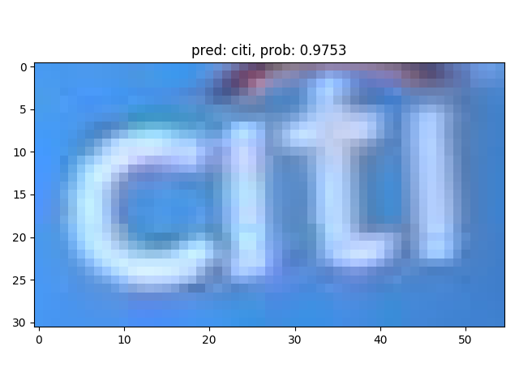

### CRNN
#### 1. 项目描述
- 通过Pytorch简单实现了[An End-to-End Trainable Neural Network for Image-based Sequence Recognition and Its Application to Scene Text Recognition](https://arxiv.org/pdf/1507.05717v1.pdf)
- 参考了[PaddleOCR](https://github.com/PaddlePaddle/PaddleOCR)

#### 2. 代码结构
```
|--models
|   |--rec_mobilenet_v3.py ：特征提取网络
|   |--sequence_encoder.py ：双向LSTM网络
|   |--rec_ctc_head.py  ： CTCloss的输入格式化
|   |--crnn ：CRNN网络
|--dataset
|   |--my_dataset.py ： 数据定义相关
|   |--transforms.py ： 数据增强相关
|   |--postprocess : 将模型输出还原为字符
|--rec_ctc_loss.py ：损失函数
|--rec_metric.py ：评价指标
|--train.py ：训练代码
|--rec.py : 模型测试识别代码
```

#### 3. 数据集
- [ICDAR_2015](https://rrc.cvc.uab.es/?ch=4&com=downloads)

#### 4. 环境配置
```
numpy==1.20.2
torch==1.8.1
opencv-python==4.5.2.54
Pillow==8.2.0
matplotlib==2.2.3
```

#### 5. 模型效果展示
 